# 实战：NFTMarketHub

## 部署脚本

```solidity
// SPDX-License-Identifier: UNLICENSED
pragma solidity ^0.8.13;

import {Script, console} from "forge-std/Script.sol";
import {MyERC20Token} from "../src/MyERC20Token.sol";

contract MyERC20TokenScript is Script {
    MyERC20Token public mytoken;

    function setUp() public {}

    function run() public {
        vm.startBroadcast();

        mytoken = new MyERC20Token(msg.sender);
        console.log("MyERC20Token deployed to:", address(mytoken));

        vm.stopBroadcast();
    }
}

```

## 部署合约

#### 报错解决


解决：`forge clean`

#### 部署成功

```shell
NFTMarketHub on  main [!] via ⬢ v22.1.0 via 🅒 base took 4.2s
➜ source .env

NFTMarketHub on  main [!] via ⬢ v22.1.0 via 🅒 base
➜ forge script --chain sepolia script/MyERC20Token.s.sol:MyERC20TokenScript --rpc-url $SEPOLIA_RPC_URL --broadcast --account MetaMask --verify -vvvv

[⠊] Compiling...
No files changed, compilation skipped
Enter keystore password:
Traces:
  [1927821] MyERC20TokenScript::run()
    ├─ [0] VM::startBroadcast()
    │   └─ ← [Return]
    ├─ [1881633] → new MyERC20Token@0xd557Bf08136D90ed553b882Eb365e0F6b9728bB1
    │   ├─ emit OwnershipTransferred(previousOwner: 0x0000000000000000000000000000000000000000, newOwner: DefaultSender: [0x1804c8AB1F12E6bbf3894d4083f33e07309d1f38])
    │   └─ ← [Return] 9047 bytes of code
    ├─ [0] console::log("MyERC20Token deployed to:", MyERC20Token: [0xd557Bf08136D90ed553b882Eb365e0F6b9728bB1]) [staticcall]
    │   └─ ← [Stop]
    ├─ [0] VM::stopBroadcast()
    │   └─ ← [Return]
    └─ ← [Stop]


Script ran successfully.

== Logs ==
  MyERC20Token deployed to: 0xd557Bf08136D90ed553b882Eb365e0F6b9728bB1

## Setting up 1 EVM.
==========================
Simulated On-chain Traces:

  [1881633] → new MyERC20Token@0xd557Bf08136D90ed553b882Eb365e0F6b9728bB1
    ├─ emit OwnershipTransferred(previousOwner: 0x0000000000000000000000000000000000000000, newOwner: DefaultSender: [0x1804c8AB1F12E6bbf3894d4083f33e07309d1f38])
    └─ ← [Return] 9047 bytes of code


==========================

Chain 11155111

Estimated gas price: 15.090597416 gwei

Estimated total gas used for script: 2722903

Estimated amount required: 0.041090232975818648 ETH

==========================

##### sepolia
✅  [Success]Hash: 0xe8faf9a7c819bd8d4a2f5ca01030d3c420df711731703988b33011b327c2f8f5
Contract Address: 0xd557Bf08136D90ed553b882Eb365e0F6b9728bB1
Block: 6326818
Paid: 0.016047232328922354 ETH (2095191 gas * 7.659078494 gwei)

✅ Sequence #1 on sepolia | Total Paid: 0.016047232328922354 ETH (2095191 gas * avg 7.659078494 gwei)


==========================

ONCHAIN EXECUTION COMPLETE & SUCCESSFUL.
##
Start verification for (1) contracts
Start verifying contract `0xd557Bf08136D90ed553b882Eb365e0F6b9728bB1` deployed on sepolia

Submitting verification for [src/MyERC20Token.sol:MyERC20Token] 0xd557Bf08136D90ed553b882Eb365e0F6b9728bB1.

Submitting verification for [src/MyERC20Token.sol:MyERC20Token] 0xd557Bf08136D90ed553b882Eb365e0F6b9728bB1.

Submitting verification for [src/MyERC20Token.sol:MyERC20Token] 0xd557Bf08136D90ed553b882Eb365e0F6b9728bB1.

Submitting verification for [src/MyERC20Token.sol:MyERC20Token] 0xd557Bf08136D90ed553b882Eb365e0F6b9728bB1.

Submitting verification for [src/MyERC20Token.sol:MyERC20Token] 0xd557Bf08136D90ed553b882Eb365e0F6b9728bB1.
Submitted contract for verification:
        Response: `OK`
        GUID: `cwwzeekad22aijh7sqhtlifbz11icmwignhtdf9dcbmdtfczrb`
        URL: https://sepolia.etherscan.io/address/0xd557bf08136d90ed553b882eb365e0f6b9728bb1
Contract verification status:
Response: `NOTOK`
Details: `Pending in queue`
Contract verification status:
Response: `OK`
Details: `Pass - Verified`
Contract successfully verified
All (1) contracts were verified!

Transactions saved to: /Users/qiaopengjun/Code/solidity-code/NFTMarketHub/broadcast/MyERC20Token.s.sol/11155111/run-latest.json

Sensitive values saved to: /Users/qiaopengjun/Code/solidity-code/NFTMarketHub/cache/MyERC20Token.s.sol/11155111/run-latest.json


```

<https://sepolia.etherscan.io/address/0xd557bf08136d90ed553b882eb365e0f6b9728bb1>


部署问题修改

```shell
NFTMarketHub on  main [!?] via ⬢ v22.1.0 via 🅒 base took 1m 26.6s
➜ source .env

NFTMarketHub on  main [!?] via ⬢ v22.1.0 via 🅒 base
➜ forge script --chain sepolia MyERC20TokenScript --rpc-url $SEPOLIA_RPC_URL --broadcast --verify -vvvv
[⠊] Compiling...
[⠔] Compiling 1 files with Solc 0.8.20
[⠒] Solc 0.8.20 finished in 1.44s
Compiler run successful!
Traces:
  [2355225] → new MyERC20TokenScript@0x5b73C5498c1E3b4dbA84de0F1833c4a029d90519
    └─ ← [Return] 11653 bytes of code

  [98] MyERC20TokenScript::setUp()
    └─ ← [Stop]

  [2950] MyERC20TokenScript::run()
    ├─ [0] VM::envUint("PRIVATE_KEY") [staticcall]
    │   └─ ← [Revert] failed parsing $PRIVATE_KEY as type `uint256`: missing hex prefix ("0x") for hex string
    └─ ← [Revert] failed parsing $PRIVATE_KEY as type `uint256`: missing hex prefix ("0x") for hex string


Error:
script failed: failed parsing $PRIVATE_KEY as type `uint256`: missing hex prefix ("0x") for hex string

NFTMarketHub on  main [!?] via ⬢ v22.1.0 via 🅒 base took 11.7s
➜ forge script --chain sepolia MyERC20TokenScript --rpc-url $SEPOLIA_RPC_URL --broadcast --verify -vvvv

[⠊] Compiling...
No files changed, compilation skipped
Traces:
  [1929276] MyERC20TokenScript::run()
    ├─ [0] VM::envUint("PRIVATE_KEY") [staticcall]
    │   └─ ← [Return] <env var value>
    ├─ [0] VM::envAddress("ACCOUNT_ADDRESS") [staticcall]
    │   └─ ← [Return] <env var value>
    ├─ [0] VM::startBroadcast(<pk>)
    │   └─ ← [Return]
    ├─ [1881633] → new MyERC20Token@0xc32cE2198B123D1c1F7FD3A9f54Bff9f975819Fa
    │   ├─ emit OwnershipTransferred(previousOwner: 0x0000000000000000000000000000000000000000, newOwner: 0x750Ea21c1e98CcED0d4557196B6f4a5974CCB6f5)
    │   └─ ← [Return] 9047 bytes of code
    ├─ [0] console::log("deployerAccountAddress :", 0x750Ea21c1e98CcED0d4557196B6f4a5974CCB6f5) [staticcall]
    │   └─ ← [Stop]
    ├─ [0] console::log("MyERC20Token deployed to:", MyERC20Token: [0xc32cE2198B123D1c1F7FD3A9f54Bff9f975819Fa]) [staticcall]
    │   └─ ← [Stop]
    ├─ [0] VM::stopBroadcast()
    │   └─ ← [Return]
    └─ ← [Stop]


Script ran successfully.

== Logs ==
  deployerAccountAddress : 0x750Ea21c1e98CcED0d4557196B6f4a5974CCB6f5
  MyERC20Token deployed to: 0xc32cE2198B123D1c1F7FD3A9f54Bff9f975819Fa

## Setting up 1 EVM.
==========================
Simulated On-chain Traces:

  [1881633] → new MyERC20Token@0xc32cE2198B123D1c1F7FD3A9f54Bff9f975819Fa
    ├─ emit OwnershipTransferred(previousOwner: 0x0000000000000000000000000000000000000000, newOwner: 0x750Ea21c1e98CcED0d4557196B6f4a5974CCB6f5)
    └─ ← [Return] 9047 bytes of code


==========================

Chain 11155111

Estimated gas price: 31.484721969 gwei

Estimated total gas used for script: 2722903

Estimated amount required: 0.085729843903556007 ETH

==========================

##### sepolia
✅  [Success]Hash: 0x6981a969928123236332cf8a1ccab58c202ccb1e056d4f99daca8d2b881749f0
Contract Address: 0xc32cE2198B123D1c1F7FD3A9f54Bff9f975819Fa
Block: 6355495
Paid: 0.032185872758241342 ETH (2095191 gas * 15.361784562 gwei)

✅ Sequence #1 on sepolia | Total Paid: 0.032185872758241342 ETH (2095191 gas * avg 15.361784562 gwei)


==========================

ONCHAIN EXECUTION COMPLETE & SUCCESSFUL.
##
Start verification for (1) contracts
Start verifying contract `0xc32cE2198B123D1c1F7FD3A9f54Bff9f975819Fa` deployed on sepolia

Submitting verification for [src/MyERC20Token.sol:MyERC20Token] 0xc32cE2198B123D1c1F7FD3A9f54Bff9f975819Fa.
Submitted contract for verification:
        Response: `OK`
        GUID: `nrfj275cavnnxjapk9jy8xl7qudvynqn7vkashvfkv2kkfzws7`
        URL: https://sepolia.etherscan.io/address/0xc32ce2198b123d1c1f7fd3a9f54bff9f975819fa
Contract verification status:
Response: `NOTOK`
Details: `Pending in queue`
Contract verification status:
Response: `OK`
Details: `Pass - Verified`
Contract successfully verified
All (1) contracts were verified!

Transactions saved to: /Users/qiaopengjun/Code/solidity-code/NFTMarketHub/broadcast/MyERC20Token.s.sol/11155111/run-latest.json

Sensitive values saved to: /Users/qiaopengjun/Code/solidity-code/NFTMarketHub/cache/MyERC20Token.s.sol/11155111/run-latest.json


NFTMarketHub on  main [!?] via ⬢ v22.1.0 via 🅒 base took 48.0s
➜
```

<https://sepolia.etherscan.io/address/0xc32ce2198b123d1c1f7fd3a9f54bff9f975819fa#code>

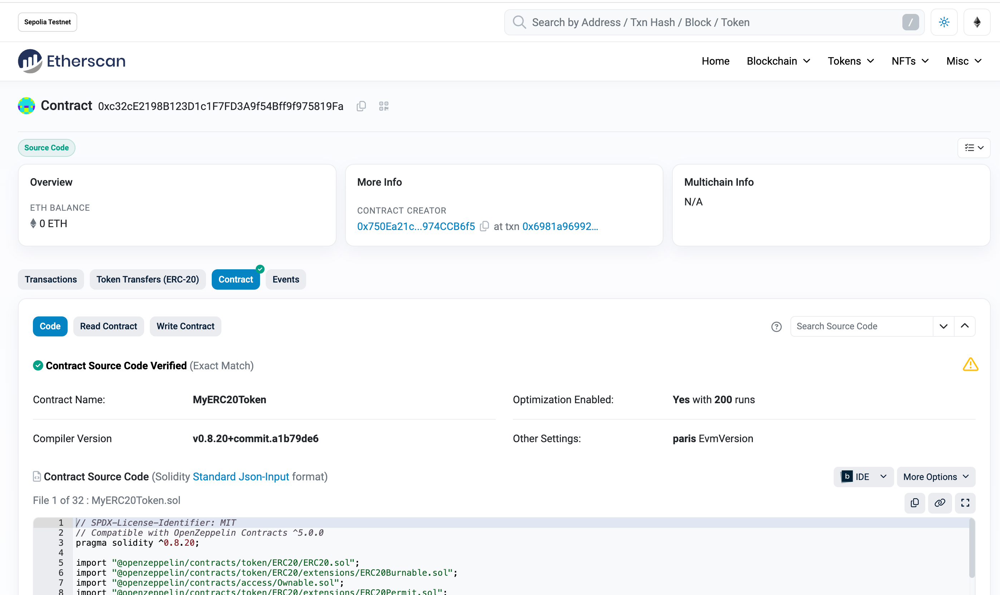

## MyERC721Token

部署脚本

```solidity
// SPDX-License-Identifier: UNLICENSED
pragma solidity ^0.8.13;

import {Script, console} from "forge-std/Script.sol";
import {MyERC721Token} from "../src/MyERC721Token.sol";

contract MyERC721TokenScript is Script {
    MyERC721Token public my721token;

    function setUp() public {}

    function run() public {
        vm.startBroadcast();

        my721token = new MyERC721Token(msg.sender);
        console.log("MyERC721Token deployed to:", address(my721token));

        vm.stopBroadcast();
    }
}

```

### 部署

```shell
NFTMarketHub on  main [!?] via ⬢ v22.1.0 via 🅒 base took 1m 18.6s
➜ source .env

NFTMarketHub on  main [!?] via ⬢ v22.1.0 via 🅒 base
➜ forge script --chain sepolia script/MyERC721Token.s.sol:MyERC721TokenScript --rpc-url $SEPOLIA_RPC_URL --broadcast --account MetaMask --verify -vvvv

[⠊] Compiling...
[⠔] Compiling 1 files with Solc 0.8.20
[⠒] Solc 0.8.20 finished in 1.44s
Compiler run successful!
Enter keystore password:
Traces:
  [2119248] MyERC721TokenScript::run()
    ├─ [0] VM::startBroadcast()
    │   └─ ← [Return]
    ├─ [2072840] → new MyERC721Token@0xC39B0eE94143C457449e16829837FD59d722933C
    │   ├─ emit OwnershipTransferred(previousOwner: 0x0000000000000000000000000000000000000000, newOwner: DefaultSender: [0x1804c8AB1F12E6bbf3894d4083f33e07309d1f38])
    │   └─ ← [Return] 10002 bytes of code
    ├─ [0] console::log("MyERC721Token deployed to:", MyERC721Token: [0xC39B0eE94143C457449e16829837FD59d722933C]) [staticcall]
    │   └─ ← [Stop]
    ├─ [0] VM::stopBroadcast()
    │   └─ ← [Return]
    └─ ← [Stop]


Script ran successfully.

== Logs ==
  MyERC721Token deployed to: 0xC39B0eE94143C457449e16829837FD59d722933C

## Setting up 1 EVM.
==========================
Simulated On-chain Traces:

  [2072840] → new MyERC721Token@0xC39B0eE94143C457449e16829837FD59d722933C
    ├─ emit OwnershipTransferred(previousOwner: 0x0000000000000000000000000000000000000000, newOwner: DefaultSender: [0x1804c8AB1F12E6bbf3894d4083f33e07309d1f38])
    └─ ← [Return] 10002 bytes of code


==========================

Chain 11155111

Estimated gas price: 10.85383427 gwei

Estimated total gas used for script: 2990587

Estimated amount required: 0.03245933566801649 ETH

==========================

##### sepolia
✅  [Success]Hash: 0x8e5b0e3a9df4e5231b88d28af9c0e6e903bf7afac027a2ee54bf5faaf67b40c0
Contract Address: 0xC39B0eE94143C457449e16829837FD59d722933C
Block: 6326900
Paid: 0.012441733790006772 ETH (2301162 gas * 5.406717906 gwei)

✅ Sequence #1 on sepolia | Total Paid: 0.012441733790006772 ETH (2301162 gas * avg 5.406717906 gwei)


==========================

ONCHAIN EXECUTION COMPLETE & SUCCESSFUL.
##
Start verification for (1) contracts
Start verifying contract `0xC39B0eE94143C457449e16829837FD59d722933C` deployed on sepolia

Submitting verification for [src/MyERC721Token.sol:MyERC721Token] 0xC39B0eE94143C457449e16829837FD59d722933C.

Submitting verification for [src/MyERC721Token.sol:MyERC721Token] 0xC39B0eE94143C457449e16829837FD59d722933C.

Submitting verification for [src/MyERC721Token.sol:MyERC721Token] 0xC39B0eE94143C457449e16829837FD59d722933C.
Submitted contract for verification:
        Response: `OK`
        GUID: `q1v8v6kswcqvnzfdifksth4hdk1ss7ukejzxxfuktumivdrr5e`
        URL: https://sepolia.etherscan.io/address/0xc39b0ee94143c457449e16829837fd59d722933c
Contract verification status:
Response: `NOTOK`
Details: `Pending in queue`
Contract verification status:
Response: `OK`
Details: `Pass - Verified`
Contract successfully verified
All (1) contracts were verified!

Transactions saved to: /Users/qiaopengjun/Code/solidity-code/NFTMarketHub/broadcast/MyERC721Token.s.sol/11155111/run-latest.json

Sensitive values saved to: /Users/qiaopengjun/Code/solidity-code/NFTMarketHub/cache/MyERC721Token.s.sol/11155111/run-latest.json


```

<https://sepolia.etherscan.io/address/0xc39b0ee94143c457449e16829837fd59d722933c>

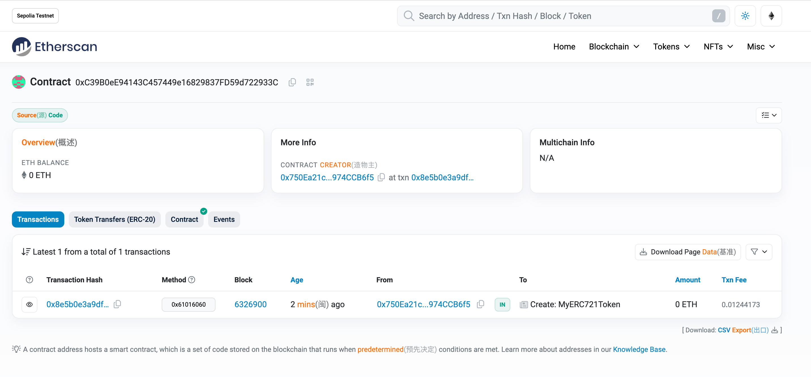

### 部署问题修改

```shell
NFTMarketHub on  main [!?] via ⬢ v22.1.0 via 🅒 base
➜ source .env

NFTMarketHub on  main [!?] via ⬢ v22.1.0 via 🅒 base
➜ forge script --chain sepolia MyERC721TokenScript --rpc-url $SEPOLIA_RPC_URL --broadcast --verify -vvvv

[⠊] Compiling...
[⠔] Compiling 1 files with Solc 0.8.20
[⠒] Solc 0.8.20 finished in 1.46s
Compiler run successful!
Traces:
  [2120084] MyERC721TokenScript::run()
    ├─ [0] VM::envUint("PRIVATE_KEY") [staticcall]
    │   └─ ← [Return] <env var value>
    ├─ [0] VM::envAddress("ACCOUNT_ADDRESS") [staticcall]
    │   └─ ← [Return] <env var value>
    ├─ [0] VM::startBroadcast(<pk>)
    │   └─ ← [Return]
    ├─ [2072840] → new MyERC721Token@0x7eA36391c7127A7f40E5c23212A8016d6E494546
    │   ├─ emit OwnershipTransferred(previousOwner: 0x0000000000000000000000000000000000000000, newOwner: 0x750Ea21c1e98CcED0d4557196B6f4a5974CCB6f5)
    │   └─ ← [Return] 10002 bytes of code
    ├─ [0] console::log("MyERC721Token deployed to:", MyERC721Token: [0x7eA36391c7127A7f40E5c23212A8016d6E494546]) [staticcall]
    │   └─ ← [Stop]
    ├─ [0] VM::stopBroadcast()
    │   └─ ← [Return]
    └─ ← [Stop]


Script ran successfully.

== Logs ==
  MyERC721Token deployed to: 0x7eA36391c7127A7f40E5c23212A8016d6E494546

## Setting up 1 EVM.
==========================
Simulated On-chain Traces:

  [2072840] → new MyERC721Token@0x7eA36391c7127A7f40E5c23212A8016d6E494546
    ├─ emit OwnershipTransferred(previousOwner: 0x0000000000000000000000000000000000000000, newOwner: 0x750Ea21c1e98CcED0d4557196B6f4a5974CCB6f5)
    └─ ← [Return] 10002 bytes of code


==========================

Chain 11155111

Estimated gas price: 53.318074191 gwei

Estimated total gas used for script: 2990587

Estimated amount required: 0.159452339540640117 ETH

==========================

##### sepolia
✅  [Success]Hash: 0x77190a6bbe59f4b98dc06b1219ca34fcf5cc1ace40f6998bb26568fcb93e5380
Contract Address: 0x7eA36391c7127A7f40E5c23212A8016d6E494546
Block: 6355525
Paid: 0.057633696474121704 ETH (2301162 gas * 25.045475492 gwei)

✅ Sequence #1 on sepolia | Total Paid: 0.057633696474121704 ETH (2301162 gas * avg 25.045475492 gwei)


==========================

ONCHAIN EXECUTION COMPLETE & SUCCESSFUL.
##
Start verification for (1) contracts
Start verifying contract `0x7eA36391c7127A7f40E5c23212A8016d6E494546` deployed on sepolia

Submitting verification for [src/MyERC721Token.sol:MyERC721Token] 0x7eA36391c7127A7f40E5c23212A8016d6E494546.

Submitting verification for [src/MyERC721Token.sol:MyERC721Token] 0x7eA36391c7127A7f40E5c23212A8016d6E494546.

Submitting verification for [src/MyERC721Token.sol:MyERC721Token] 0x7eA36391c7127A7f40E5c23212A8016d6E494546.
Submitted contract for verification:
        Response: `OK`
        GUID: `bgjivlpsttkmre2wq8etbj9gbv6txntfhwwe3rnh3zzduq12pm`
        URL: https://sepolia.etherscan.io/address/0x7ea36391c7127a7f40e5c23212a8016d6e494546
Contract verification status:
Response: `NOTOK`
Details: `Pending in queue`
Contract verification status:
Response: `OK`
Details: `Pass - Verified`
Contract successfully verified
All (1) contracts were verified!

Transactions saved to: /Users/qiaopengjun/Code/solidity-code/NFTMarketHub/broadcast/MyERC721Token.s.sol/11155111/run-latest.json

Sensitive values saved to: /Users/qiaopengjun/Code/solidity-code/NFTMarketHub/cache/MyERC721Token.s.sol/11155111/run-latest.json


NFTMarketHub on  main [!?] via ⬢ v22.1.0 via 🅒 base took 1m 27.4s
➜
```

<https://sepolia.etherscan.io/address/0x7ea36391c7127a7f40e5c23212a8016d6e494546#code>

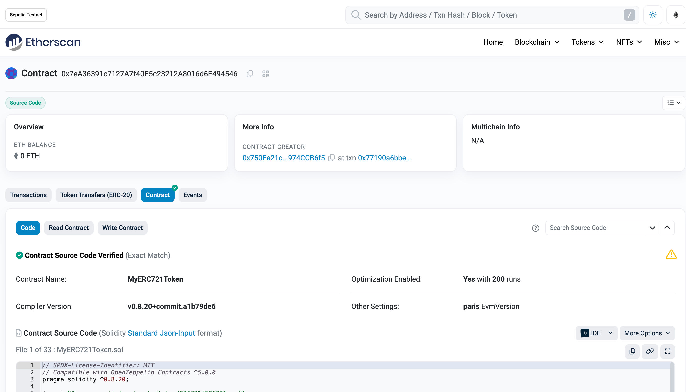

### NFTMarket

#### 部署脚本

```solidity
// SPDX-License-Identifier: UNLICENSED
pragma solidity ^0.8.13;

import {Script, console} from "forge-std/Script.sol";
import {NFTMarket} from "../src/NFTMarket.sol";

contract NFTMarketScript is Script {
    NFTMarket public nftmarket;
    address public mytokenAddress;
    address public my721tokenAddress;

    function setUp() public {
        // 设置已部署的合约地址
        mytokenAddress = 0xd557Bf08136D90ed553b882Eb365e0F6b9728bB1;
        my721tokenAddress = 0xC39B0eE94143C457449e16829837FD59d722933C;
    }

    function run() public {
        vm.startBroadcast();

        // 部署 NFTMarket 合约，传入已部署的 mytoken 和 my721token 地址
        nftmarket = new NFTMarket(mytokenAddress, my721tokenAddress);
        // 使用 console.log 打印合约地址
        console.log("NFTMarket deployed to:", address(nftmarket));

        vm.stopBroadcast();
    }
}

```

#### 部署

```shell
NFTMarketHub on  main [!?] via ⬢ v22.1.0 via 🅒 base took 1m 20.1s
➜ source .env

NFTMarketHub on  main [!?] via ⬢ v22.1.0 via 🅒 base
➜ forge script --chain sepolia script/NFTMarket.s.sol:NFTMarketScript --rpc-url $SEPOLIA_RPC_URL --broadcast --account MetaMask --verify -vvvv

[⠊] Compiling...
[⠆] Compiling 1 files with Solc 0.8.20
[⠰] Solc 0.8.20 finished in 1.23s
Compiler run successful with warnings:
Warning (5667): Unused function parameter. Remove or comment out the variable name to silence this warning.
   --> src/NFTMarket.sol:112:9:
    |
112 |         address operator,
    |         ^^^^^^^^^^^^^^^^

Enter keystore password:
Traces:
  [1387543] NFTMarketScript::run()
    ├─ [0] VM::startBroadcast()
    │   └─ ← [Return]
    ├─ [1337828] → new NFTMarket@0xAb9BbaFd906977ec7c24F7a04A84E26d60Db0221
    │   └─ ← [Return] 6459 bytes of code
    ├─ [0] console::log("NFTMarket deployed to:", NFTMarket: [0xAb9BbaFd906977ec7c24F7a04A84E26d60Db0221]) [staticcall]
    │   └─ ← [Stop]
    ├─ [0] VM::stopBroadcast()
    │   └─ ← [Return]
    └─ ← [Stop]


Script ran successfully.

== Logs ==
  NFTMarket deployed to: 0xAb9BbaFd906977ec7c24F7a04A84E26d60Db0221

## Setting up 1 EVM.
==========================
Simulated On-chain Traces:

  [1337828] → new NFTMarket@0xAb9BbaFd906977ec7c24F7a04A84E26d60Db0221
    └─ ← [Return] 6459 bytes of code


==========================

Chain 11155111

Estimated gas price: 11.806426763 gwei

Estimated total gas used for script: 1947535

Estimated amount required: 0.022993429345879205 ETH

==========================

##### sepolia
✅  [Success]Hash: 0x0510b605c1b19eef0ec95a90ae12687e6bfbdd226c9d05d557727c7d6ad0b9b0
Contract Address: 0xAb9BbaFd906977ec7c24F7a04A84E26d60Db0221
Block: 6327016
Paid: 0.009214901996610328 ETH (1498534 gas * 6.149277892 gwei)

✅ Sequence #1 on sepolia | Total Paid: 0.009214901996610328 ETH (1498534 gas * avg 6.149277892 gwei)


==========================

ONCHAIN EXECUTION COMPLETE & SUCCESSFUL.
##
Start verification for (1) contracts
Start verifying contract `0xAb9BbaFd906977ec7c24F7a04A84E26d60Db0221` deployed on sepolia

Submitting verification for [src/NFTMarket.sol:NFTMarket] 0xAb9BbaFd906977ec7c24F7a04A84E26d60Db0221.

Submitting verification for [src/NFTMarket.sol:NFTMarket] 0xAb9BbaFd906977ec7c24F7a04A84E26d60Db0221.

Submitting verification for [src/NFTMarket.sol:NFTMarket] 0xAb9BbaFd906977ec7c24F7a04A84E26d60Db0221.
Submitted contract for verification:
        Response: `OK`
        GUID: `sv6lc6u9pnsdrdwb6wa9nci5nz5dfy69bvms5ncbzinkzjgqfb`
        URL: https://sepolia.etherscan.io/address/0xab9bbafd906977ec7c24f7a04a84e26d60db0221
Contract verification status:
Response: `NOTOK`
Details: `Pending in queue`
Contract verification status:
Response: `OK`
Details: `Pass - Verified`
Contract successfully verified
All (1) contracts were verified!

Transactions saved to: /Users/qiaopengjun/Code/solidity-code/NFTMarketHub/broadcast/NFTMarket.s.sol/11155111/run-latest.json

Sensitive values saved to: /Users/qiaopengjun/Code/solidity-code/NFTMarketHub/cache/NFTMarket.s.sol/11155111/run-latest.json


```

<https://sepolia.etherscan.io/address/0xab9bbafd906977ec7c24f7a04a84e26d60db0221#code>

#### 浏览器查看

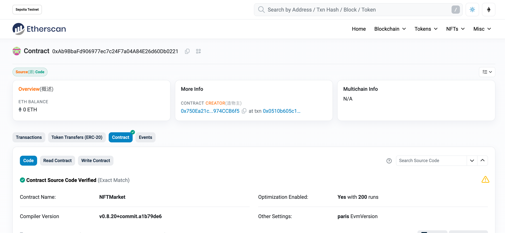

白名单的清单是在用户系统上线之前，项目方已经把白名单的地址都已经确认好了。

可能基于某种规则，例如：空投，它会基于某种规则去看一下你这个用户是不是有资格购买

可能你在的项目里面做过很多的参与，有活跃度，你的账号就有空投

可能你是种子用户，你也有空投

可能你买过早期的一些NFT，也有空投

... ...

综合一些规则，它会筛选出一批地址作为白名单的清单

白名单就是相当于给这部分用户赋能，让他们可以以低于市场价格的方式，通过白名单的机制，可以快速以低价低成本去购买NFT

那我就设置一个白名单，只有白名单的用户，他才有资格去购买，用很低的价格去购买我们的NFT。

项目方在早期根据他们内部的规则，在链上检索出来一批地址，把这一批地址作为它白名单的用户。只允许这部分用户进行交易，这个类似咱们发现哪个项目上线了新的token去check一下有没有资格，能不能获得一些空投的代币

白名单是链下确认好的，链上只做校验就行。

白名单是项目方提供的，用户向项目方服务器（中心化）请求获取签名信息。

如果是白名单用户，就使用EIP712签名一下，标识该用户是白名单用户。

用户拿到签名就可以发送交易，发送交易时钱包会对该交易进行签名，则该交易就会被广播到网络中去，最终会执行链上的合约。合约会去校验白名单的资格（EIP712），根据签名等信息计算解密恢复出签名者，判断签名者是不是合约的owner。如果是合约的owner，则说明它是个有效的签名，并且这个user是一个白名单的用户。

### 为NFTMarket增加`PermitBuy` 方法后再次部署

```solidity
// SPDX-License-Identifier: UNLICENSED
pragma solidity ^0.8.13;

import {Script, console} from "forge-std/Script.sol";
import {NFTMarket} from "../src/NFTMarket.sol";

contract NFTMarketScript is Script {
    NFTMarket public nftmarket;
    address public mytokenAddress;
    address public my721tokenAddress;

    function setUp() public {
        // 设置已部署的合约地址
        mytokenAddress = 0xd557Bf08136D90ed553b882Eb365e0F6b9728bB1;
        my721tokenAddress = 0xC39B0eE94143C457449e16829837FD59d722933C;
    }

    function run() public {
        vm.startBroadcast();

        // 部署 NFTMarket 合约，传入已部署的 mytoken 和 my721token 地址
        nftmarket = new NFTMarket(mytokenAddress, my721tokenAddress);
        // 使用 console.log 打印合约地址
        console.log("NFTMarket deployed to:", address(nftmarket));

        vm.stopBroadcast();
    }
}

```

部署

```shell

NFTMarketHub on  main [!] via ⬢ v22.1.0 via 🅒 base took 3.4s
➜ source .env

NFTMarketHub on  main [!] via ⬢ v22.1.0 via 🅒 base
➜ forge script --chain sepolia script/NFTMarket.s.sol:NFTMarketScript --rpc-url $SEPOLIA_RPC_URL --broadcast --account MetaMask --verify -vvvv

[⠊] Compiling...
[⠊] Compiling 3 files with Solc 0.8.20
[⠒] Solc 0.8.20 finished in 1.93s
Compiler run successful!
Enter keystore password:
Traces:
  [2043633] NFTMarketScript::run()
    ├─ [0] VM::startBroadcast()
    │   └─ ← [Return]
    ├─ [1992986] → new NFTMarket@0x3A06A90ad3C4FCdE1Ab3fDAC72a9edB5CD14677f
    │   └─ ← [Return] 9725 bytes of code
    ├─ [0] console::log("NFTMarket deployed to:", NFTMarket: [0x3A06A90ad3C4FCdE1Ab3fDAC72a9edB5CD14677f]) [staticcall]
    │   └─ ← [Stop]
    ├─ [0] VM::stopBroadcast()
    │   └─ ← [Return]
    └─ ← [Stop]


Script ran successfully.

== Logs ==
  NFTMarket deployed to: 0x3A06A90ad3C4FCdE1Ab3fDAC72a9edB5CD14677f

## Setting up 1 EVM.
==========================
Simulated On-chain Traces:

  [1992986] → new NFTMarket@0x3A06A90ad3C4FCdE1Ab3fDAC72a9edB5CD14677f
    └─ ← [Return] 9725 bytes of code


==========================

Chain 11155111

Estimated gas price: 26.370614208 gwei

Estimated total gas used for script: 2880891

Estimated amount required: 0.075970865136299328 ETH

==========================

##### sepolia
✅  [Success]Hash: 0x8438578450ffa07e4c8f221535ea4951909483dc50983cd0c62f7d4ceddcbcac
Contract Address: 0x3A06A90ad3C4FCdE1Ab3fDAC72a9edB5CD14677f
Block: 6337744
Paid: 0.031346262499763324 ETH (2216762 gas * 14.140562902 gwei)

✅ Sequence #1 on sepolia | Total Paid: 0.031346262499763324 ETH (2216762 gas * avg 14.140562902 gwei)


==========================

ONCHAIN EXECUTION COMPLETE & SUCCESSFUL.
##
Start verification for (1) contracts
Start verifying contract `0x3A06A90ad3C4FCdE1Ab3fDAC72a9edB5CD14677f` deployed on sepolia

Submitting verification for [src/NFTMarket.sol:NFTMarket] 0x3A06A90ad3C4FCdE1Ab3fDAC72a9edB5CD14677f.

Submitting verification for [src/NFTMarket.sol:NFTMarket] 0x3A06A90ad3C4FCdE1Ab3fDAC72a9edB5CD14677f.

Submitting verification for [src/NFTMarket.sol:NFTMarket] 0x3A06A90ad3C4FCdE1Ab3fDAC72a9edB5CD14677f.

Submitting verification for [src/NFTMarket.sol:NFTMarket] 0x3A06A90ad3C4FCdE1Ab3fDAC72a9edB5CD14677f.
Submitted contract for verification:
        Response: `OK`
        GUID: `bhfxcbiwflxy5mu7sbal5vdpu1wnmgj1vdayjj98jbfyzmd8w5`
        URL: https://sepolia.etherscan.io/address/0x3a06a90ad3c4fcde1ab3fdac72a9edb5cd14677f
Contract verification status:
Response: `NOTOK`
Details: `Pending in queue`
Contract verification status:
Response: `OK`
Details: `Pass - Verified`
Contract successfully verified
All (1) contracts were verified!

Transactions saved to: /Users/qiaopengjun/Code/solidity-code/NFTMarketHub/broadcast/NFTMarket.s.sol/11155111/run-latest.json

Sensitive values saved to: /Users/qiaopengjun/Code/solidity-code/NFTMarketHub/cache/NFTMarket.s.sol/11155111/run-latest.json

```

浏览器查看

<https://sepolia.etherscan.io/address/0x3a06a90ad3c4fcde1ab3fdac72a9edb5cd14677f>

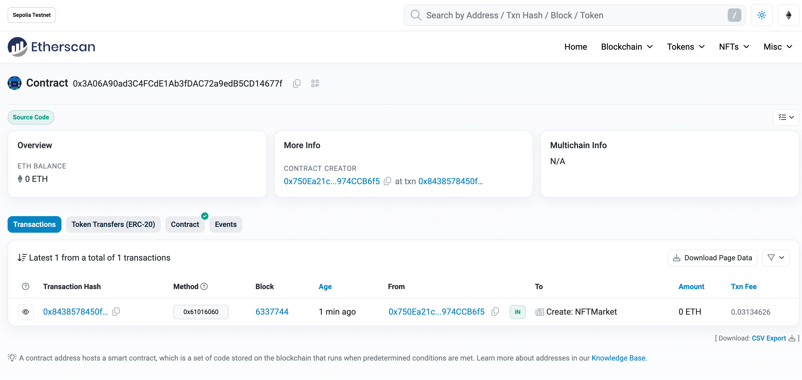

部署问题修改

```shell
NFTMarketHub on  main [!?] via ⬢ v22.1.0 via 🅒 base took 18.9s
➜ forge script --chain sepolia NFTMarketScript --rpc-url $SEPOLIA_RPC_URL --broadcast --verify -vvvv

[⠊] Compiling...
[⠔] Compiling 1 files with Solc 0.8.20
[⠑] Solc 0.8.20 finished in 1.49s
Compiler run successful!
Traces:
  [2204791] NFTMarketScript::run()
    ├─ [0] VM::envUint("PRIVATE_KEY") [staticcall]
    │   └─ ← [Return] <env var value>
    ├─ [0] VM::startBroadcast(<pk>)
    │   └─ ← [Return]
    ├─ [2153567] → new NFTMarket@0xbba4229cD53442D56E306379E99332687E1fb31f
    │   └─ ← [Return] 10527 bytes of code
    ├─ [0] console::log("NFTMarket deployed to:", NFTMarket: [0xbba4229cD53442D56E306379E99332687E1fb31f]) [staticcall]
    │   └─ ← [Stop]
    ├─ [0] VM::stopBroadcast()
    │   └─ ← [Return]
    └─ ← [Stop]


Script ran successfully.

== Logs ==
  NFTMarket deployed to: 0xbba4229cD53442D56E306379E99332687E1fb31f

## Setting up 1 EVM.
==========================
Simulated On-chain Traces:

  [2153567] → new NFTMarket@0xbba4229cD53442D56E306379E99332687E1fb31f
    └─ ← [Return] 10527 bytes of code


==========================

Chain 11155111

Estimated gas price: 18.910148766 gwei

Estimated total gas used for script: 3106171

Estimated amount required: 0.058738155702634986 ETH

==========================

##### sepolia
✅  [Success]Hash: 0xaeee3435e8bde06251a1424c7609f5b3cfcac536e95388a27574f8dd589b5b7a
Contract Address: 0xbba4229cD53442D56E306379E99332687E1fb31f
Block: 6356694
Paid: 0.02398914687063458 ETH (2390105 gas * 10.036858996 gwei)

✅ Sequence #1 on sepolia | Total Paid: 0.02398914687063458 ETH (2390105 gas * avg 10.036858996 gwei)


==========================

ONCHAIN EXECUTION COMPLETE & SUCCESSFUL.
##
Start verification for (1) contracts
Start verifying contract `0xbba4229cD53442D56E306379E99332687E1fb31f` deployed on sepolia

Submitting verification for [src/NFTMarket.sol:NFTMarket] 0xbba4229cD53442D56E306379E99332687E1fb31f.

Submitting verification for [src/NFTMarket.sol:NFTMarket] 0xbba4229cD53442D56E306379E99332687E1fb31f.

Submitting verification for [src/NFTMarket.sol:NFTMarket] 0xbba4229cD53442D56E306379E99332687E1fb31f.
Submitted contract for verification:
        Response: `OK`
        GUID: `ayc58d9cqkj7v1uwxzmh4qxrriqgtcj5g8ywzff2y5gjzt29ry`
        URL: https://sepolia.etherscan.io/address/0xbba4229cd53442d56e306379e99332687e1fb31f
Contract verification status:
Response: `NOTOK`
Details: `Pending in queue`
Contract verification status:
Response: `OK`
Details: `Pass - Verified`
Contract successfully verified
All (1) contracts were verified!

Transactions saved to: /Users/qiaopengjun/Code/solidity-code/NFTMarketHub/broadcast/NFTMarket.s.sol/11155111/run-latest.json

Sensitive values saved to: /Users/qiaopengjun/Code/solidity-code/NFTMarketHub/cache/NFTMarket.s.sol/11155111/run-latest.json


```

<https://sepolia.etherscan.io/address/0xbba4229cd53442d56e306379e99332687e1fb31f#code>

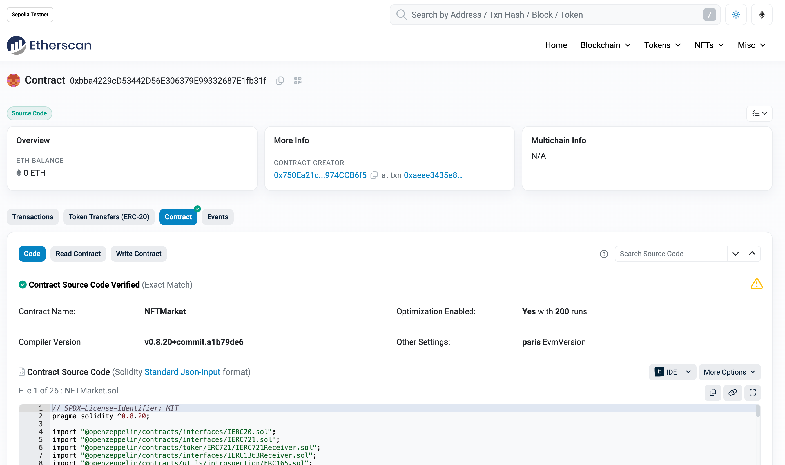

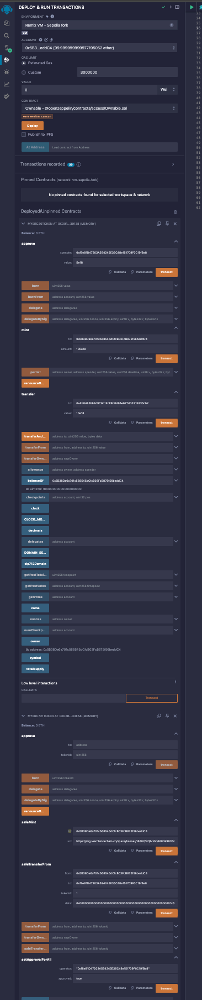

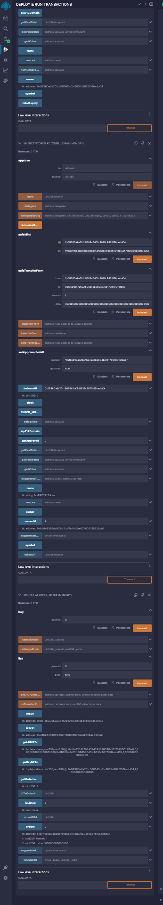

## 为NFTMarket创建一个The Graph子图

### 学习资料

- 快速入门： <https://thegraph.com/docs/zh/quick-start/>
- 如何编写一个子图的详细介绍 <https://thegraph.com/docs/zh/developing/creating-a-subgraph/>
- 如何查询一个子图的详细介绍 <https://thegraph.com/docs/zh/querying/querying-from-an-application/>
- 中文相关资源列表： <https://www.notion.so/graphprotocolcn/The-Graph-49977afa44644ebf9052b9220f539396>
- The graph bounty中一个比较好的子图的例子： <https://github.com/Autosaida/Zircuit-Restaking-Subgraph/>
- The graph bounty中一个比较好的Usage of Subgraph的例子：<https://github.com/ttttonyhe/stader-graph-dashboard>

### 步骤

1. 安装Graph CLI 在本地环境中安装Graph CLI工具
2. 初始化子图 使用Graph CLI初始化一个新的子图
3. 配置子图（subgraph.yaml） 设置要索引的NFTMarket合约和List、Buy事件
4. 定义Schema（schema.graphql） 定义List和Buy实体
5. 编写映射（mapping.ts） 编写映射逻辑，以处理合约事件并更新子图的存储
6. 部署子图 使用Graph CLI工具部署子图到The Graph Studio。

### 实操

#### 1 创建子图

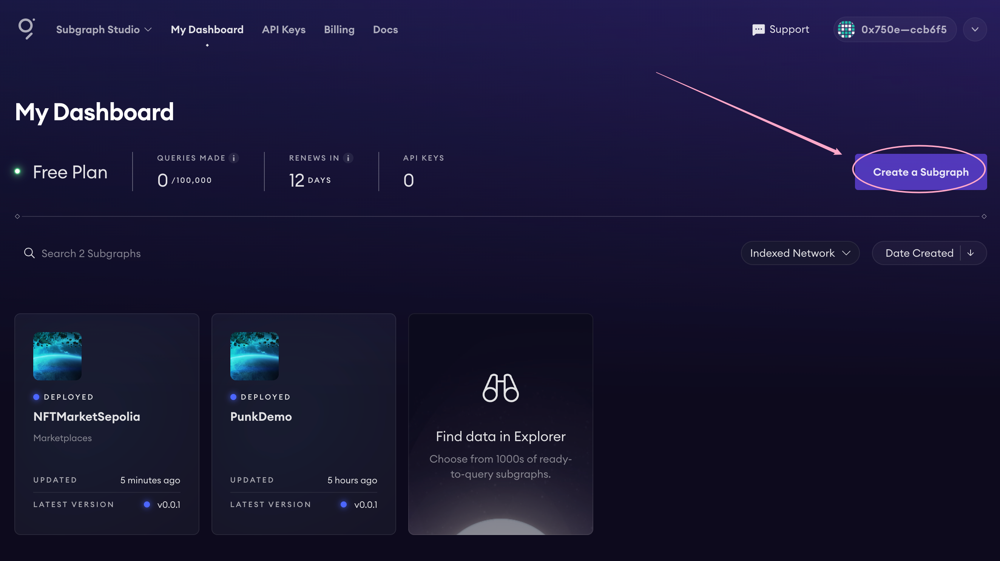

#### 2 填写子图名称

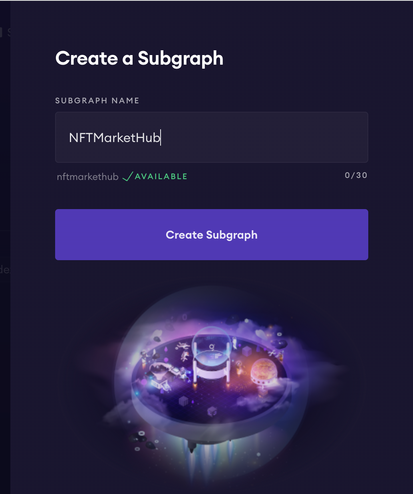

#### 3 填写描述信息和源码链接（注意：描述信息必填否则不能保存）

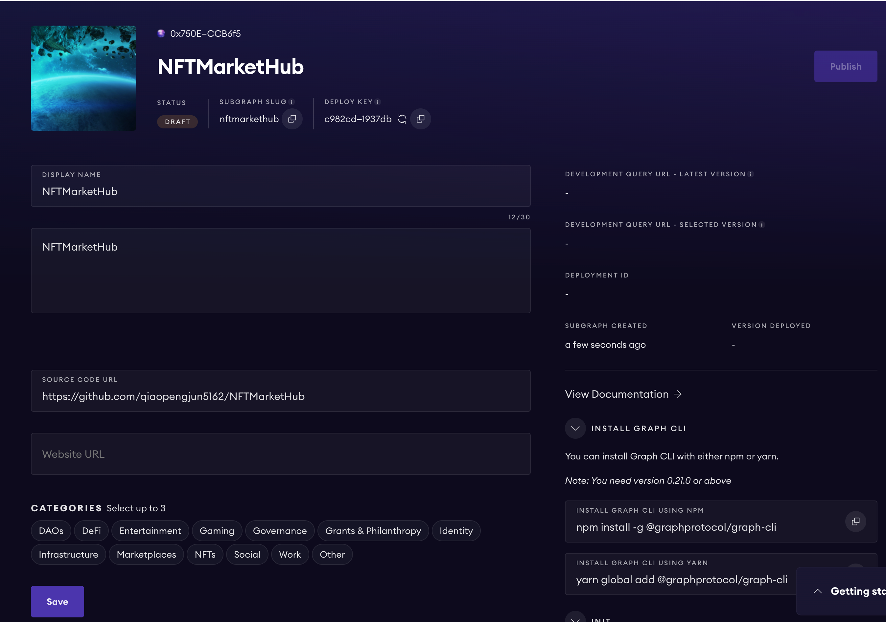

#### 4 点击 Save 后即可根据右方的命令去执行对应的操作

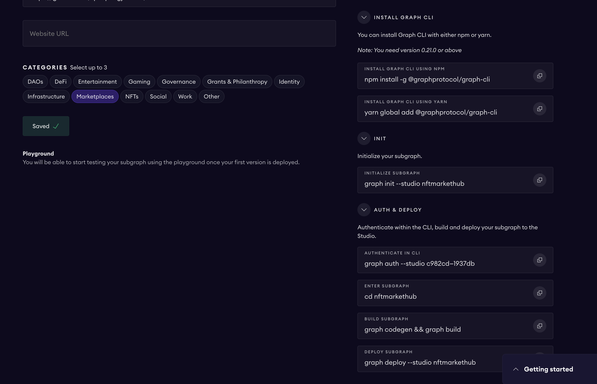

#### 5 安装  GRAPH CLI

```shell
pnpm install -g @graphprotocol/graph-cli
```

#### 6 初始化子图

```shell
graph init --studio nftmarkethub
```

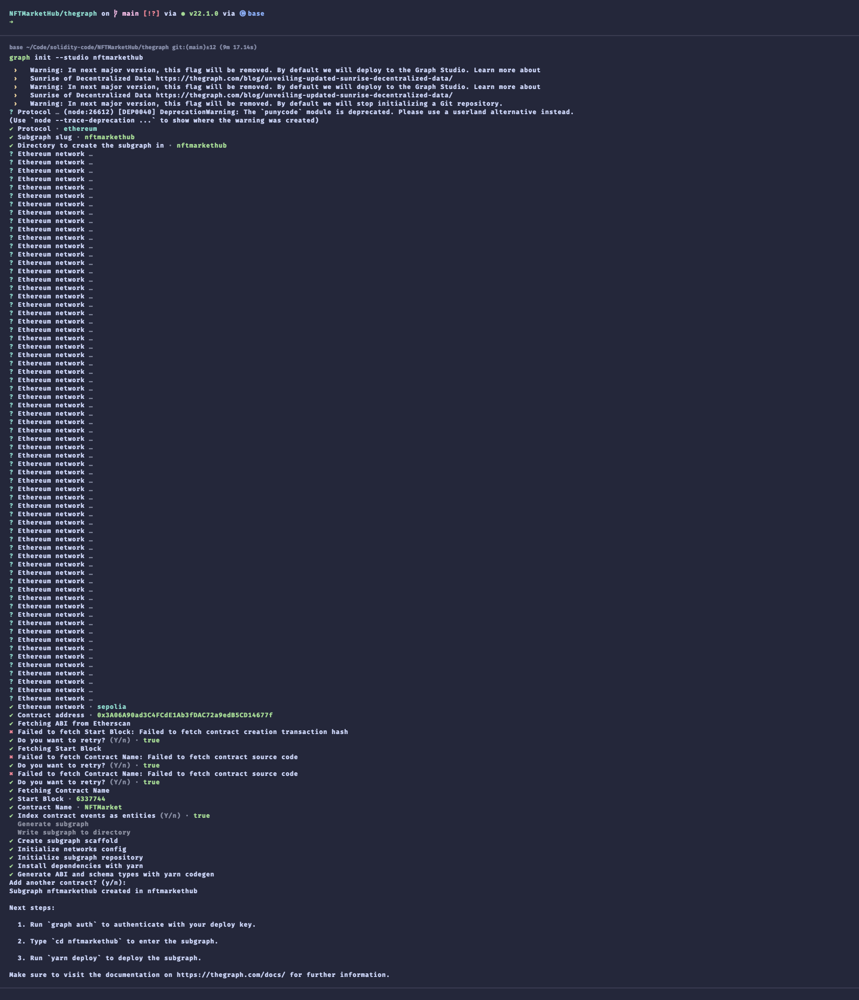

#### 7 认证

```shell
graph auth --studio c982cd704d2e5525feae40467e1937db
```

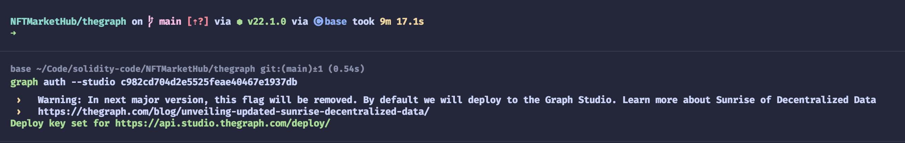

#### 8 切换目录

```shell
cd nftmarkethub
```

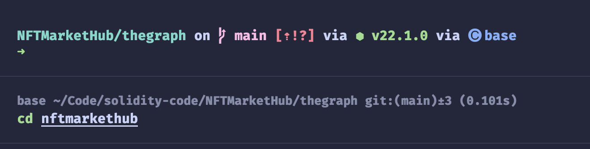

#### 9 BUILD 子图

```shell
graph codegen && graph build
```

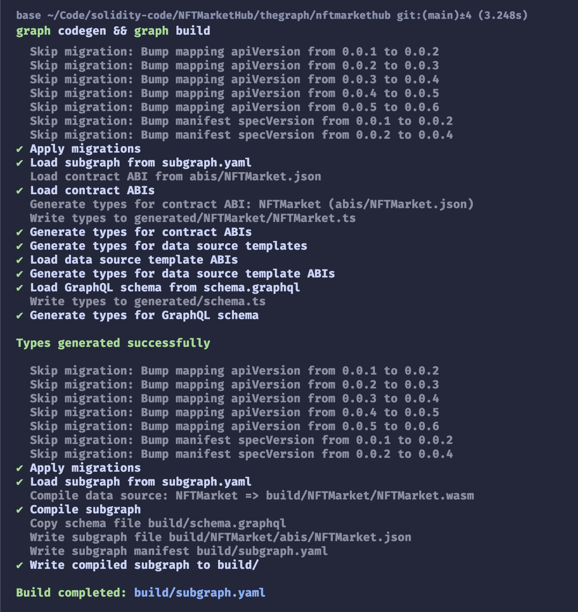

#### 10 部署子图

```shell
graph deploy --studio nftmarkethub
```

失败

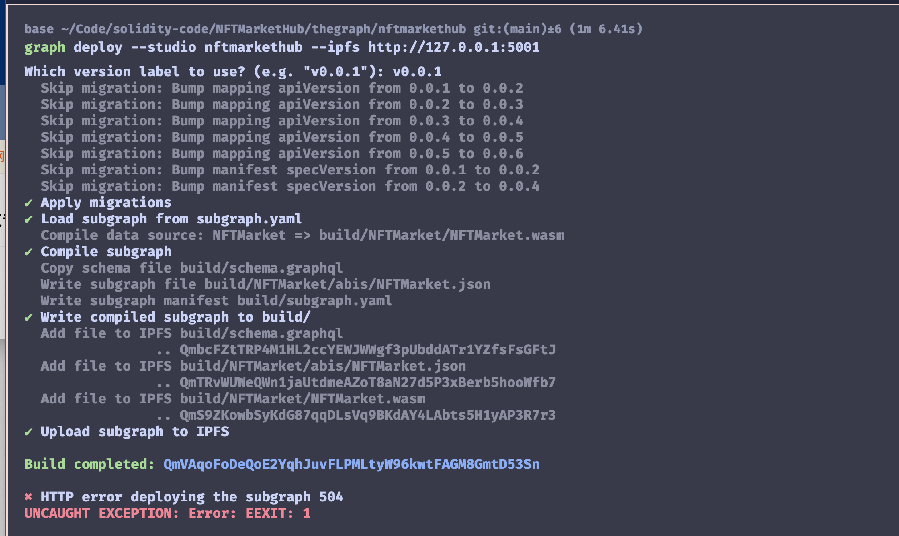

试图查询失败信息

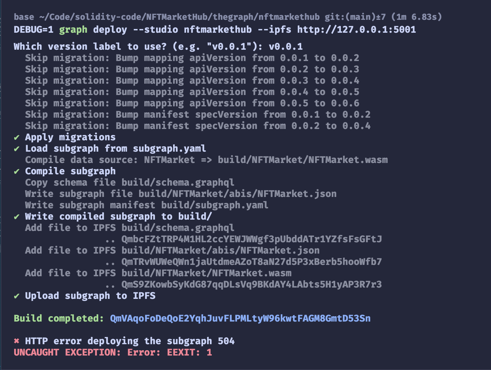

解决

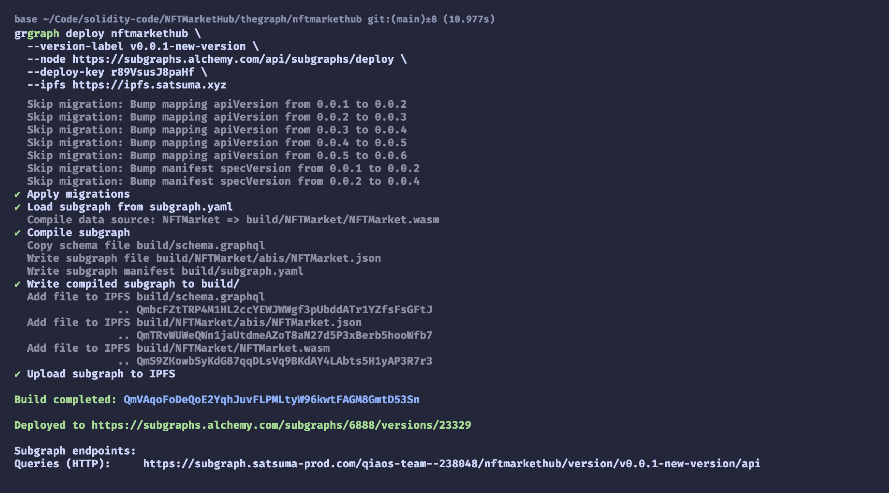

<https://subgraphs.alchemy.com/onboarding>

<https://subgraphs.alchemy.com/subgraphs/6888>

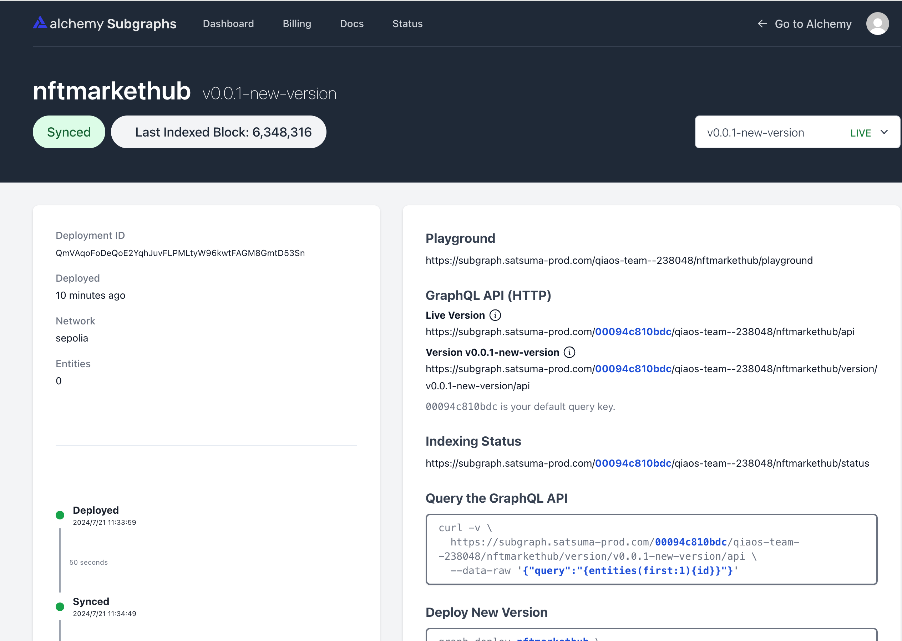

<https://subgraph.satsuma-prod.com/qiaos-team--238048/nftmarkethub/playground>

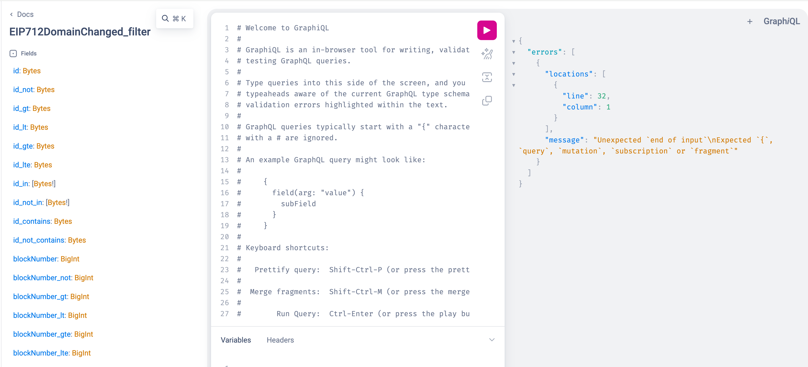

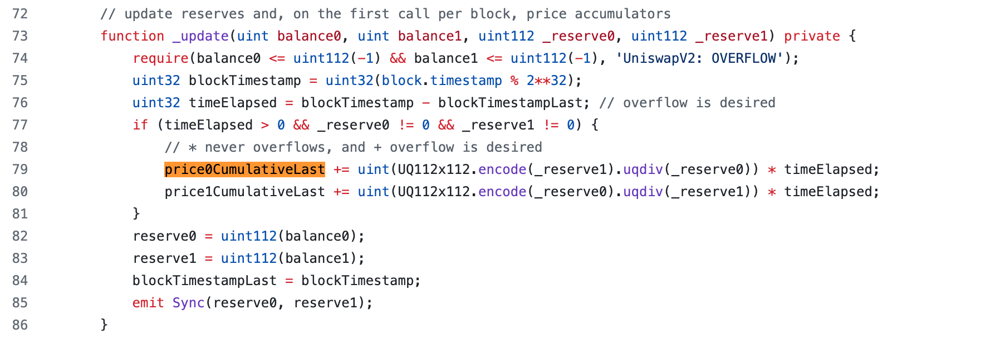

```shell
graph init --studio nftmarkethub
 ›   Warning: In next major version, this flag will be removed. By default we will deploy to the Graph Studio. Learn more about Sunrise of
 ›   Decentralized Data https://thegraph.com/blog/unveiling-updated-sunrise-decentralized-data/
 ›   Warning: In next major version, this flag will be removed. By default we will deploy to the Graph Studio. Learn more about Sunrise of
 ›   Decentralized Data https://thegraph.com/blog/unveiling-updated-sunrise-decentralized-data/
 ›   Warning: In next major version, this flag will be removed. By default we will stop initializing a Git repository.
? Protocol … (node:28795) [DEP0040] DeprecationWarning: The `punycode` module is deprecated. Please use a userland alternative instead.
(Use `node --trace-deprecation ...` to show where the warning was created)
✔ Protocol · ethereum
✔ Subgraph slug · nftmarkethub
✔ Directory to create the subgraph in · nftmarkethub
? Ethereum network …
? Ethereum network …
? Ethereum network …
✔ Ethereum network · sepolia
✔ Contract address · 0xbba4229cD53442D56E306379E99332687E1fb31f
✔ Fetching ABI from Etherscan
✖ Failed to fetch Start Block: Failed to fetch contract creation transaction hash
✔ Do you want to retry? (Y/n) · true
✔ Fetching Start Block
✖ Failed to fetch Contract Name: Failed to fetch contract source code
✔ Do you want to retry? (Y/n) · true
✖ Failed to fetch Contract Name: Failed to fetch contract source code
✔ Do you want to retry? (Y/n) · true
✖ Failed to fetch Contract Name: Failed to fetch contract source code
✔ Do you want to retry? (Y/n) · true
✔ Fetching Contract Name
✔ Start Block · 6356694
✔ Contract Name · NFTMarket
✔ Index contract events as entities (Y/n) · true
  Generate subgraph
  Write subgraph to directory
✔ Create subgraph scaffold
✔ Initialize networks config
✔ Initialize subgraph repository
✔ Install dependencies with yarn
✔ Generate ABI and schema types with yarn codegen
Add another contract? (y/n):
Subgraph nftmarkethub created in nftmarkethub

Next steps:

  1. Run `graph auth` to authenticate with your deploy key.

  2. Type `cd nftmarkethub` to enter the subgraph.

  3. Run `yarn deploy` to deploy the subgraph.

Make sure to visit the documentation on https://thegraph.com/docs/ for further information.

NFTMarketHub/thegraph/thegraph on  main [⇡?] via ⬢ v22.1.0 via 🅒 base took 2m 40.6s
➜
graph auth --studio c982cd704d2e5525feae40467e1937db
 ›   Warning: In next major version, this flag will be removed. By default we will deploy to the Graph Studio. Learn more about Sunrise of
 ›   Decentralized Data https://thegraph.com/blog/unveiling-updated-sunrise-decentralized-data/
Deploy key set for https://api.studio.thegraph.com/deploy/

NFTMarketHub/thegraph/thegraph on  main [⇡?] via ⬢ v22.1.0 via 🅒 base
➜
cd nftmarkethub

NFTMarketHub/thegraph/thegraph/nftmarkethub on  main [⇡?] via ⬢ v22.1.0 via 🅒 base
➜
graph codegen && graph build
  Skip migration: Bump mapping apiVersion from 0.0.1 to 0.0.2
  Skip migration: Bump mapping apiVersion from 0.0.2 to 0.0.3
  Skip migration: Bump mapping apiVersion from 0.0.3 to 0.0.4
  Skip migration: Bump mapping apiVersion from 0.0.4 to 0.0.5
  Skip migration: Bump mapping apiVersion from 0.0.5 to 0.0.6
  Skip migration: Bump manifest specVersion from 0.0.1 to 0.0.2
  Skip migration: Bump manifest specVersion from 0.0.2 to 0.0.4
✔ Apply migrations
✔ Load subgraph from subgraph.yaml
  Load contract ABI from abis/NFTMarket.json
✔ Load contract ABIs
  Generate types for contract ABI: NFTMarket (abis/NFTMarket.json)
  Write types to generated/NFTMarket/NFTMarket.ts
✔ Generate types for contract ABIs
✔ Generate types for data source templates
✔ Load data source template ABIs
✔ Generate types for data source template ABIs
✔ Load GraphQL schema from schema.graphql
  Write types to generated/schema.ts
✔ Generate types for GraphQL schema

Types generated successfully

  Skip migration: Bump mapping apiVersion from 0.0.1 to 0.0.2
  Skip migration: Bump mapping apiVersion from 0.0.2 to 0.0.3
  Skip migration: Bump mapping apiVersion from 0.0.3 to 0.0.4
  Skip migration: Bump mapping apiVersion from 0.0.4 to 0.0.5
  Skip migration: Bump mapping apiVersion from 0.0.5 to 0.0.6
  Skip migration: Bump manifest specVersion from 0.0.1 to 0.0.2
  Skip migration: Bump manifest specVersion from 0.0.2 to 0.0.4
✔ Apply migrations
✔ Load subgraph from subgraph.yaml
  Compile data source: NFTMarket => build/NFTMarket/NFTMarket.wasm
✔ Compile subgraph
  Copy schema file build/schema.graphql
  Write subgraph file build/NFTMarket/abis/NFTMarket.json
  Write subgraph manifest build/subgraph.yaml
✔ Write compiled subgraph to build/

Build completed: build/subgraph.yaml


NFTMarketHub/thegraph/thegraph/nftmarkethub on  main [⇡?] via ⬢ v22.1.0 via 🅒 base took 3.0s
➜
graph deploy --studio nftmarkethub
Which version label to use? (e.g. "v0.0.1"): v0.0.1
  Skip migration: Bump mapping apiVersion from 0.0.1 to 0.0.2
  Skip migration: Bump mapping apiVersion from 0.0.2 to 0.0.3
  Skip migration: Bump mapping apiVersion from 0.0.3 to 0.0.4
  Skip migration: Bump mapping apiVersion from 0.0.4 to 0.0.5
  Skip migration: Bump mapping apiVersion from 0.0.5 to 0.0.6
  Skip migration: Bump manifest specVersion from 0.0.1 to 0.0.2
  Skip migration: Bump manifest specVersion from 0.0.2 to 0.0.4
✔ Apply migrations
✔ Load subgraph from subgraph.yaml
  Compile data source: NFTMarket => build/NFTMarket/NFTMarket.wasm
✔ Compile subgraph
  Copy schema file build/schema.graphql
  Write subgraph file build/NFTMarket/abis/NFTMarket.json
  Write subgraph manifest build/subgraph.yaml
✔ Write compiled subgraph to build/
  Add file to IPFS build/schema.graphql
                .. QmbcFZtTRP4M1HL2ccYEWJWWgf3pUbddATr1YZfsFsGFtJ
  Add file to IPFS build/NFTMarket/abis/NFTMarket.json
                .. QmNdh74x1i5W8vxJ9mB3574ei7m32HMbpiAgfiNkdKfYnC
  Add file to IPFS build/NFTMarket/NFTMarket.wasm
                .. QmS9ZKowbSyKdG87qqDLsVq9BKdAY4LAbts5H1yAP3R7r3
✔ Upload subgraph to IPFS

Build completed: QmebNDDAaXBAfo2abeEajWimikjQL63BnXAmh2JyPn6XTr

Deployed to https://thegraph.com/studio/subgraph/nftmarkethub

Subgraph endpoints:
Queries (HTTP):     https://api.studio.thegraph.com/query/83263/nftmarkethub/v0.0.1


```

## 实战：NFTMarketHub 部署

1. 部署 ERC20 合约
2. 部署 ERC721 合约
3. 使用ERC20 合约地址 和 ERC721 合约地址作为初始化参数部署 NFTMarket 合约
4. 账户1 在 ERC20 合约上 mint token
5. 账户1 在 ERC721 合约上 safeMint NFT
6. 账户1 在 ERC721 合约上调用 setApprovalForAll 授权 NFTMarket 合约，参数为 NFTMarket 合约地址和 true
7. 账户1 在 ERC20 合约上调用 transfer 转移 10个 ERC20 token 给 账户2
8. 账户2 在 ERC20 合约上调用 approve 方法授权 NFTMarket 合约使用1个ERC20token，参数为 NFTMarket 合约地址 和数量 1,000,000,000,000,000,000
9. 账户2 在 NFTMarket 合约上调用 buyNFT 购买 tokenId 为 0 的 NFT
10. 查看账户1 和账户2 的 ERC20 和 ERC721 余额 （balanceOf）

```shell
➜ forge test --match-path ./test/NFTMarketTest.sol -vv > NFTMarketHubTest.txt
➜ forge test --match-path ./test/NFTMarketTest.sol --show-progress -w  -vvvv
```

## 参考

- <https://github.com/OpenZeppelin/openzeppelin-contracts/blob/master/contracts/interfaces/IERC2612.sol>
- <https://github.com/OpenZeppelin/openzeppelin-contracts/blob/master/contracts/mocks/EIP712Verifier.sol>
- <https://github.com/OpenZeppelin/openzeppelin-contracts/blob/master/contracts/utils/cryptography/EIP712.sol>
- <https://github.com/OpenZeppelin/openzeppelin-contracts/blob/master/contracts/token/ERC20/extensions/IERC20Permit.sol>
- <https://github.com/OpenZeppelin/openzeppelin-contracts/blob/master/contracts/token/ERC20/extensions/ERC20Permit.sol>
- <https://eips.ethereum.org/EIPS/eip-712>
- <https://eips.ethereum.org/EIPS/eip-2612>
- <https://www.openzeppelin.com/contracts>
- <https://github.com/AmazingAng/WTF-Solidity/blob/main/37_Signature/readme.md>
- <https://github.com/AmazingAng/WTF-Solidity/blob/main/52_EIP712/readme.md>
- <https://github.com/jesperkristensen58/ERC712-Permit-Example>
- <https://book.getfoundry.sh/tutorials/testing-eip712>
